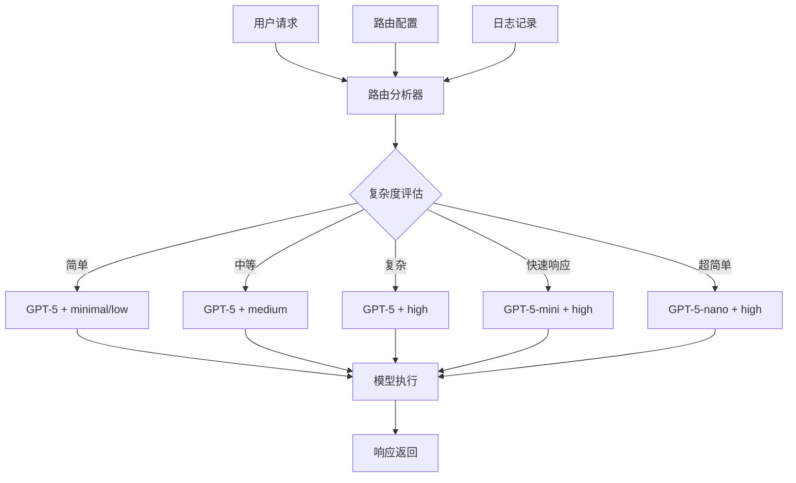

# Design Document

## Overview

本设计文档描述了 gpt-5-nano 路由扩展功能的技术架构。该功能将增强现有的 OpenAI 集成，使 gpt-5-nano 能够智能地分析问题复杂度并路由到合适的 GPT-5 系列模型，同时为每个模型配置相应的推理级别。

系统将基于现有的 `src/lib/openai.ts` 和 `src/lib/types.ts` 架构进行扩展，保持向后兼容性的同时添加新的路由功能。

## Architecture

### 核心组件架构



### 系统层次结构

1. **路由层 (Routing Layer)**: 负责问题分析和模型选择
2. **配置层 (Configuration Layer)**: 管理模型配置和推理级别设置
3. **执行层 (Execution Layer)**: 处理实际的 API 调用
4. **监控层 (Monitoring Layer)**: 记录和分析路由决策

## Components and Interfaces

### 1. 路由配置接口

```typescript
// 推理级别枚举
export type ReasoningLevel = 'minimal' | 'low' | 'medium' | 'high';

// 扩展的模型配置
export interface ExtendedModelConfig extends ModelConfig {
  availableReasoningLevels: ReasoningLevel[];
  defaultReasoningLevel: ReasoningLevel;
  routingPriority: number; // 路由优先级
}

// 路由决策结果
export interface RoutingDecision {
  targetModel: ModelId;
  reasoningLevel: ReasoningLevel;
  confidence: number; // 决策置信度 0-1
  reasoning: string; // 决策理由
  fallbackModel?: ModelId; // 备选模型
}

// 复杂度分析结果
export interface ComplexityAnalysis {
  score: number; // 复杂度分数 0-100
  factors: {
    textLength: number;
    questionType: 'factual' | 'analytical' | 'creative' | 'technical';
    domainSpecific: boolean;
    multiStep: boolean;
    requiresReasoning: boolean;
  };
  category: 'simple' | 'medium' | 'complex';
}
```

### 2. 路由器核心类

```typescript
export class GPT5Router {
  private config: RouterConfig;
  private logger: RouterLogger;
  
  constructor(config: RouterConfig);
  
  // 主要路由方法
  async route(input: string | any[], context?: RoutingContext): Promise<RoutingDecision>;
  
  // 复杂度分析
  private analyzeComplexity(input: string | any[]): Promise<ComplexityAnalysis>;
  
  // 模型选择逻辑
  private selectModel(complexity: ComplexityAnalysis, context?: RoutingContext): RoutingDecision;
  
  // 推理级别选择
  private selectReasoningLevel(model: ModelId, complexity: ComplexityAnalysis): ReasoningLevel;
}
```

### 3. 配置管理器

```typescript
export interface RouterConfig {
  models: Record<ModelId, ExtendedModelConfig>;
  thresholds: {
    simpleComplexity: number; // 简单问题阈值
    mediumComplexity: number; // 中等复杂度阈值
    fastResponseTime: number; // 快速响应时间要求(ms)
  };
  fallbackStrategy: 'conservative' | 'aggressive';
  enableLogging: boolean;
}

export class RouterConfigManager {
  private config: RouterConfig;
  
  loadConfig(): RouterConfig;
  updateConfig(updates: Partial<RouterConfig>): void;
  validateConfig(config: RouterConfig): boolean;
}
```

## Data Models

### 1. 扩展的模型定义

```typescript
// 更新 MODELS 配置以支持推理级别
export const EXTENDED_MODELS: Record<ModelId, ExtendedModelConfig> = {
  'gpt-5': {
    ...MODELS['gpt-5'],
    availableReasoningLevels: ['minimal', 'low', 'medium', 'high'],
    defaultReasoningLevel: 'medium',
    routingPriority: 1,
  },
  'gpt-5-mini': {
    ...MODELS['gpt-5-mini'],
    availableReasoningLevels: ['high'],
    defaultReasoningLevel: 'high',
    routingPriority: 2,
  },
  'gpt-5-nano': {
    ...MODELS['gpt-5-nano'],
    availableReasoningLevels: ['high'],
    defaultReasoningLevel: 'high',
    routingPriority: 3,
  },
};
```

### 2. 路由日志模型

```typescript
export interface RoutingLog {
  id: string;
  timestamp: Date;
  inputHash: string; // 输入内容的哈希值（隐私保护）
  complexityAnalysis: ComplexityAnalysis;
  routingDecision: RoutingDecision;
  executionTime: number;
  success: boolean;
  errorMessage?: string;
  responseQuality?: number; // 可选的响应质量评分
}
```

### 3. 路由上下文

```typescript
export interface RoutingContext {
  userId?: string;
  conversationId?: string;
  responseTimeRequirement?: 'fast' | 'normal' | 'quality';
  previousModel?: ModelId; // 上一次使用的模型
  userPreferences?: {
    preferQuality: boolean;
    preferSpeed: boolean;
    maxCost?: number;
  };
}
```

## Error Handling

### 1. 路由错误处理策略

```typescript
export class RoutingError extends Error {
  constructor(
    message: string,
    public code: string,
    public fallbackModel?: ModelId
  ) {
    super(message);
    this.name = 'RoutingError';
  }
}

// 错误处理策略
export const ERROR_HANDLING_STRATEGIES = {
  MODEL_UNAVAILABLE: {
    action: 'fallback',
    fallbackModel: 'gpt-5-nano',
    retryCount: 2,
  },
  COMPLEXITY_ANALYSIS_FAILED: {
    action: 'default',
    defaultModel: 'gpt-5',
    defaultReasoningLevel: 'medium',
  },
  ROUTING_TIMEOUT: {
    action: 'fast_fallback',
    fallbackModel: 'gpt-5-nano',
    timeout: 5000, // 5秒超时
  },
};
```

### 2. 降级策略

```typescript
export interface FallbackStrategy {
  primary: ModelId;
  secondary: ModelId;
  emergency: ModelId;
  maxRetries: number;
  timeoutMs: number;
}

export const DEFAULT_FALLBACK_STRATEGY: FallbackStrategy = {
  primary: 'gpt-5',
  secondary: 'gpt-5-mini',
  emergency: 'gpt-5-nano',
  maxRetries: 3,
  timeoutMs: 30000,
};
```

## Testing Strategy

### 1. 单元测试

- **复杂度分析器测试**: 验证不同类型问题的复杂度评估准确性
- **路由决策测试**: 测试各种输入场景下的模型选择逻辑
- **推理级别选择测试**: 验证推理级别选择的正确性
- **配置管理测试**: 测试配置加载、验证和更新功能

### 2. 集成测试

- **端到端路由测试**: 从用户输入到模型响应的完整流程测试
- **错误处理测试**: 验证各种错误场景下的降级策略
- **性能测试**: 测试路由决策的响应时间和资源消耗
- **并发测试**: 验证多用户同时使用时的系统稳定性

### 3. 测试数据集

```typescript
export const TEST_CASES = {
  SIMPLE_QUESTIONS: [
    "今天天气怎么样？",
    "1+1等于几？",
    "你好，请介绍一下自己",
  ],
  MEDIUM_QUESTIONS: [
    "请解释一下机器学习的基本概念",
    "如何优化网站的SEO？",
    "分析一下当前经济形势",
  ],
  COMPLEX_QUESTIONS: [
    "设计一个分布式系统架构来处理百万级用户",
    "分析量子计算对现代密码学的影响",
    "制定一个完整的产品营销策略",
  ],
};
```

### 4. 性能基准

- **路由决策时间**: < 100ms (95th percentile)
- **复杂度分析时间**: < 50ms (95th percentile)
- **内存使用**: < 10MB 额外内存占用
- **准确率目标**: 路由决策准确率 > 85%

## Implementation Considerations

### 1. 向后兼容性

- 保持现有 `createResponse` 和 `createChatCompletion` API 不变
- 新功能通过可选参数和配置启用
- 现有代码无需修改即可继续工作

### 2. 性能优化

- 使用缓存机制避免重复的复杂度分析
- 异步处理路由决策以减少延迟
- 批量处理多个请求以提高效率

### 3. 可扩展性

- 模块化设计支持添加新的模型和推理级别
- 插件式架构支持自定义路由策略
- 配置驱动的行为，便于运行时调整

### 4. 监控和调试

- 详细的日志记录用于问题诊断
- 性能指标收集和分析
- A/B 测试支持用于优化路由策略

### 5. 安全考虑

- 输入内容哈希化保护用户隐私
- 访问控制确保配置安全
- 防止恶意输入导致的资源滥用